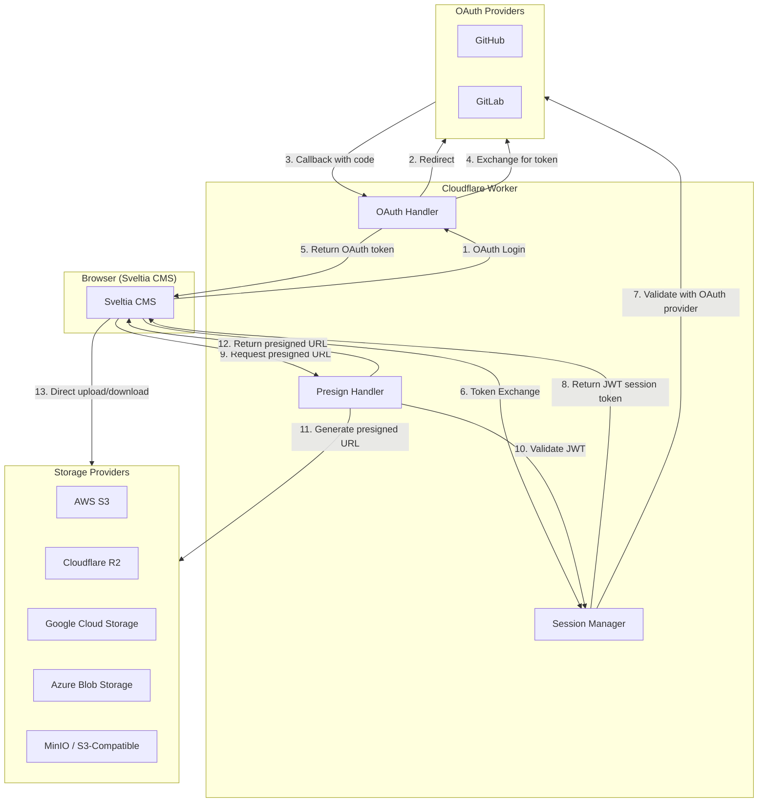

# Sveltia CMS Authenticator

This [Cloudflare Workers](https://workers.cloudflare.com/) script allows [Sveltia CMS](https://github.com/sveltia/sveltia-cms) (or Netlify/Decap CMS) users to authenticate with [GitHub](https://docs.github.com/en/apps/oauth-apps/building-oauth-apps/authorizing-oauth-apps) or [GitLab](https://docs.gitlab.com/ee/api/oauth2.html#authorization-code-flow), and provides secure presigned URL generation for cloud storage backends (S3, R2, GCS, Azure).

You don’t have to use it if you previously had Netlify/Decap CMS and your site is still being deployed to Netlify or if you have already used [another 3rd party OAuth client](https://decapcms.org/docs/external-oauth-clients/).

You can use it if your site is hosted (or has been moved to) somewhere else, such as [Cloudflare Pages](https://pages.cloudflare.com/) or [GitHub Pages](https://pages.github.com/), and you don’t have any other 3rd party client yet.

<!-- prettier-ignore-start -->
> [!TIP]
> Sveltia CMS users can now sign in directly with a Git-based backend using a personal access token (PAT) instead of going through the regular OAuth flow. If you’re a developer and the sole user of your CMS instance, the PAT method is much simpler than setting up this authenticator. However, if you have multiple users or non-technical users, you may still want to use the OAuth client for a better user experience.

> [!NOTE]
> GitHub plans to support [client-side PKCE for SPAs](https://github.com/github/roadmap/issues/1153) soon. Once that’s available, this authenticator will be deprecated for GitHub users since Sveltia CMS will be able to authenticate directly with GitHub without a backend.
>
> GitLab has supported client-side PKCE for a while already — see our [documentation](https://sveltiacms.app/en/docs/backends/gitlab#pkce-authorization) for how to set it up without this authenticator.
<!-- prettier-ignore-end -->

## Architecture



### Key Features

- **OAuth Authentication**: Support for GitHub and GitLab OAuth flows
- **Session Management**: JWT-based session tokens for secure API access
- **Presigned URLs**: Generate time-limited URLs for direct cloud storage access
- **Multi-Cloud Support**: AWS S3, Cloudflare R2, Google Cloud Storage, Azure Blob Storage, MinIO
- **Vendor Agnostic**: Auto-detects storage provider from environment variables

## How to use it

### Step 1. Deploy this project to Cloudflare Workers

Sign up with Cloudflare, and click the button below to start deploying.

[](https://deploy.workers.cloudflare.com/?url=https://github.com/walkthru-earth/sveltia-cms-auth)

Alternatively, you can clone the project and run [`wrangler deploy`](https://developers.cloudflare.com/workers/wrangler/commands/#deploy) locally.

Once deployed, open your Cloudflare Workers dashboard, select the `sveltia-cms-auth` service, then the worker URL (`https://sveltia-cms-auth.<SUBDOMAIN>.workers.dev`) will be displayed. Copy it for Step 2. It will also be used in Step 4.

### Step 2. Register the Worker as an OAuth app

#### GitHub

[Register a new OAuth application](https://github.com/settings/applications/new) on GitHub ([details](https://docs.github.com/en/apps/oauth-apps/building-oauth-apps/creating-an-oauth-app)) with the following properties, including your Worker URL from Step 1:

- Application name: `Sveltia CMS Authenticator` (or whatever)
- Homepage URL: `https://github.com/walkthru-earth/sveltia-cms-auth` (or whatever)
- Application description: (can be left empty)
- Authorization callback URL: `<YOUR_WORKER_URL>/callback`

Once registered, click on the **Generate a new client secret** button. The app’s **Client ID** and **Client Secret** will be displayed. We’ll use them in Step 3 below.

#### GitLab

[Register a new OAuth application](https://gitlab.com/-/user_settings/applications) on GitLab ([details](https://docs.gitlab.com/ee/integration/oauth_provider.html#create-a-user-owned-application)) with the following properties, including your Worker URL from Step 1:

- Name: `Sveltia CMS Authenticator` (or whatever)
- Redirect URI: `<YOUR_WORKER_URL>/callback`
- Confidential: Yes
- Scopes: `api` only

Once registered, the app’s **Application ID** and **Secret** will be displayed. We’ll use them in Step 3 below.

### Step 3. Configure the Worker

Go back to the `sveltia-cms-auth` service page on the Cloudflare dashboard, select **Settings** > **Variables**, and add the following Environment Variables to your worker ([details](https://developers.cloudflare.com/workers/platform/environment-variables/#environment-variables-via-the-dashboard)):

#### GitHub

- `GITHUB_CLIENT_ID`: **Client ID** from Step 2
- `GITHUB_CLIENT_SECRET`: **Client Secret** from Step 2; click the **Encrypt** button to hide it
- `GITHUB_HOSTNAME`: Required only if you’re using GitHub Enterprise Server. Default: `github.com`

#### GitLab

- `GITLAB_CLIENT_ID`: **Application ID** from Step 2
- `GITLAB_CLIENT_SECRET`: **Secret** from Step 2; click the **Encrypt** button to hide it
- `GITLAB_HOSTNAME`: Required only if you’re using a self-hosted instance. Default: `gitlab.com`

#### Both GitHub and GitLab

- `ALLOWED_DOMAINS`: (Optional) Your site’s hostname, e.g. `www.example.com`
  - Multiple hostnames can be defined as a comma-separated list, e.g. `www.example.com, www.example.org`
  - A wildcard (`*`) can be used to match any subdomain, e.g. `*.example.com` that will match `www.example.com`, `blog.example.com`, `docs.api.example.com`, etc. (but not `example.com`)
  - To match a `www`-less naked domain and all the subdomains, use `example.com, *.example.com`

Save and deploy.

### Step 3b. Configure Presigned URLs (Optional)

If you want to use cloud storage backends (S3, R2, GCS, Azure) with Sveltia CMS, configure the following additional environment variables.

#### Session Secret (Required for presigned URLs)

- `JWT_SECRET`: A secret key for signing session tokens. Generate with: `openssl rand -hex 32`

#### Storage Provider (Choose ONE)

##### AWS S3

- `S3_ACCESS_KEY_ID`: AWS access key ID
- `S3_SECRET_ACCESS_KEY`: AWS secret access key
- `S3_BUCKET`: S3 bucket name
- `S3_REGION`: (Optional) AWS region. Default: `us-east-1`
- `S3_ENDPOINT`: (Optional) Custom endpoint for S3-compatible services
- `S3_FORCE_PATH_STYLE`: (Optional) Set to `true` for MinIO or path-style URLs
- `S3_PATH_PREFIX`: (Optional) Path prefix for all operations. Useful for shared buckets like [Source Cooperative](https://source.coop/) where you have write access only to a specific prefix (e.g., `walkthru-earth/opensensor-space`)

##### Cloudflare R2

- `R2_ACCESS_KEY_ID`: R2 access key ID
- `R2_SECRET_ACCESS_KEY`: R2 secret access key
- `R2_ACCOUNT_ID`: Cloudflare account ID
- `R2_BUCKET`: R2 bucket name
- `R2_PATH_PREFIX`: (Optional) Path prefix for all operations

##### Google Cloud Storage

- `GCS_PROJECT_ID`: GCP project ID
- `GCS_BUCKET`: GCS bucket name
- `GCS_SERVICE_ACCOUNT_KEY`: Service account JSON key (as a string)
- `GCS_PATH_PREFIX`: (Optional) Path prefix for all operations

##### Azure Blob Storage

- `AZURE_STORAGE_ACCOUNT`: Azure storage account name
- `AZURE_STORAGE_KEY`: Azure storage account key
- `AZURE_CONTAINER`: Azure container name
- `AZURE_PATH_PREFIX`: (Optional) Path prefix for all operations

#### Access Control (Optional)

- `ALLOWED_ORIGINS`: Comma-separated list of allowed CORS origins, e.g. `https://example.com`

### Step 4. Update your CMS configuration

Open `admin/config.yml` locally or remotely, and add your Worker URL from Step 1 as the new `base_url` property under `backend`:

```diff
 backend:
   name: github # or gitlab
   repo: username/repo
   branch: main
+  base_url: <YOUR_WORKER_URL>
```

Commit the change. Once deployed, you can sign into Sveltia CMS remotely with GitHub or GitLab!

## FAQ

### Why do I have to set this thing up in the first place?

Technically, we could host Sveltia CMS Authenticator on our own server and let anyone use it, just like Netlify does. The cost probably wouldn’t matter because it’s just a small, short-lived script. However, running such a **service** certainly comes with legal, privacy and security liabilities that we cannot afford. Remember that Sveltia CMS is nothing more than [@kyoshino](https://github.com/kyoshino)’s personal project. That’s why the authenticator is not offered as SaaS and you have to install it yourself.

## API Reference

### OAuth Endpoints

| Endpoint    | Method | Description            |
| ----------- | ------ | ---------------------- |
| `/auth`     | GET    | Start OAuth flow       |
| `/callback` | GET    | OAuth callback handler |

### Session Endpoints

| Endpoint          | Method | Description                                                       |
| ----------------- | ------ | ----------------------------------------------------------------- |
| `/session`        | GET    | Validate session token (requires `Authorization: Bearer <token>`) |
| `/token-exchange` | POST   | Exchange OAuth token for session token                            |

**Token Exchange Request:**

```json
{
  "provider": "github",
  "token": "<oauth_access_token>"
}
```

**Token Exchange Response:**

```json
{
  "sessionToken": "<jwt_token>",
  "user": { "id": "123", "name": "User", "login": "username" },
  "expiresIn": 14400
}
```

### Presigned URL Endpoints

| Endpoint         | Method | Description                                |
| ---------------- | ------ | ------------------------------------------ |
| `/presign`       | POST   | Generate presigned URL for single path     |
| `/presign-batch` | POST   | Generate presigned URLs for multiple paths |

All presign endpoints require `Authorization: Bearer <session_token>` header.

**Single Presign Request:**

```json
{
  "operation": "GET",
  "path": "uploads/image.jpg",
  "contentType": "image/jpeg",
  "provider": "s3",
  "bucket": "my-bucket"
}
```

**Single Presign Response:**

```json
{
  "url": "https://...",
  "expiresIn": 900,
  "path": "uploads/image.jpg",
  "operation": "GET"
}
```

**Batch Presign Request:**

```json
{
  "paths": ["file1.jpg", "file2.jpg"],
  "operation": "GET",
  "provider": "r2"
}
```

**Batch Presign Response:**

```json
{
  "urls": {
    "file1.jpg": "https://...",
    "file2.jpg": "https://..."
  },
  "expiresIn": 900,
  "count": 2
}
```

### Health Check

| Endpoint  | Method | Description           |
| --------- | ------ | --------------------- |
| `/health` | GET    | Health check endpoint |

## Acknowledgements

This project was inspired by [`netlify-cms-oauth-firebase`](https://github.com/Herohtar/netlify-cms-oauth-firebase).
